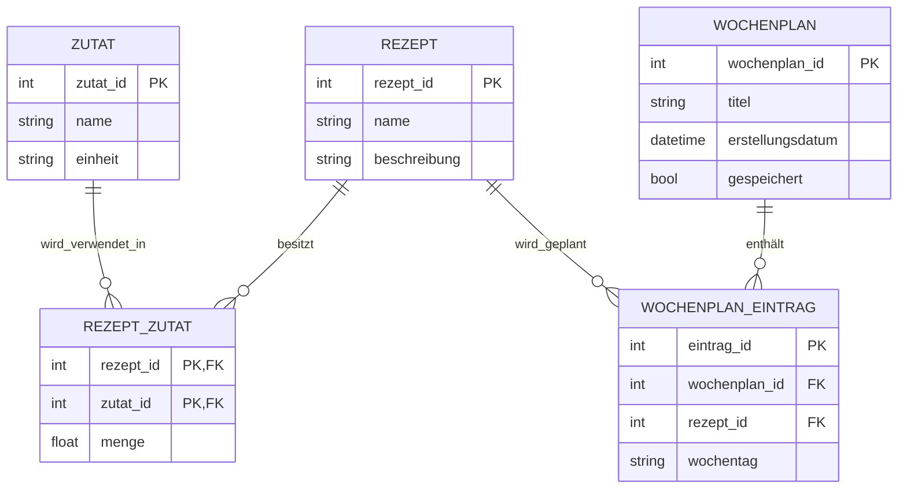

# ER-Modell MenuMaster

```mermaid
erDiagram
    REZEPT ||--o{ REZEPT_ZUTAT : besitzt
    ZUTAT ||--o{ REZEPT_ZUTAT : wird_verwendet_in
    WOCHENPLAN ||--o{ WOCHENPLAN_EINTRAG : enthält
    REZEPT ||--o{ WOCHENPLAN_EINTRAG : wird_geplant

    REZEPT {
        int rezept_id PK
        string name
        string beschreibung
    }

    ZUTAT {
        int zutat_id PK
        string name
        string einheit
    }

    REZEPT_ZUTAT {
        int rezept_id PK, FK
        int zutat_id PK, FK
        float menge
    }

    WOCHENPLAN {
        int wochenplan_id PK
        string titel
        datetime erstellungsdatum
        bool gespeichert
    }

    WOCHENPLAN_EINTRAG {
        int eintrag_id PK
        int wochenplan_id FK
        int rezept_id FK
        string wochentag
    }
```
