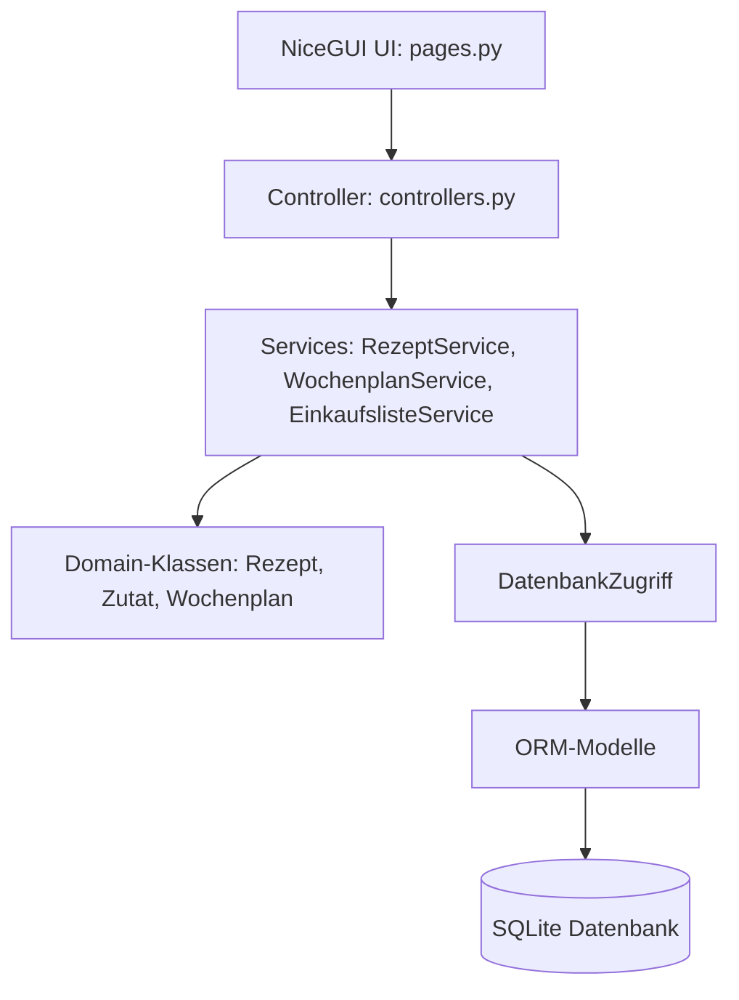

# Schichtenübersicht

```mermaid
flowchart TD
    UI[NiceGUI UI: pages.py] --> Controller[Controller: controllers.py]
    Controller --> Services[Services: RezeptService, WochenplanService, EinkaufslisteService]
    Services --> Domain[Domain-Klassen: Rezept, Zutat, Wochenplan]
    Services --> Datenzugriff[DatenbankZugriff]
    Datenzugriff --> ORM[ORM-Modelle]
    ORM --> DB[(SQLite Datenbank)]
```
