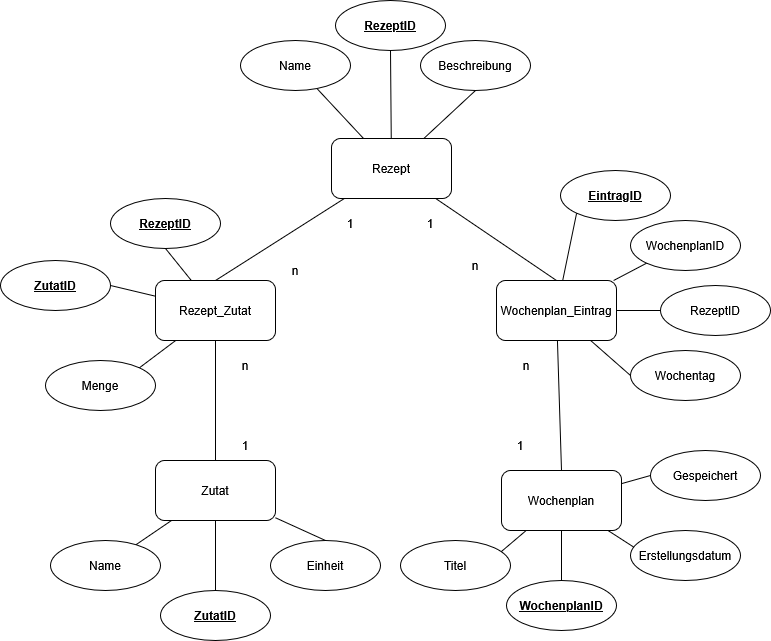
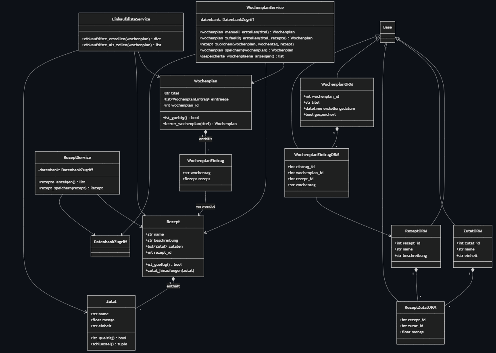

# 🍽️ MenuMaster – Meal Planning Browser App



---

Dieses Projekt entwickelt das alte **MenuMaster-Konsolenprojekt** aus dem 1. Semester zu einer browserbasierten Anwendung weiter. Die neue Version nutzt **NiceGUI**, eine **SQLite-Datenbank** und ein **ORM** über SQLAlchemy.

Das Projekt soll:

- den Prozess von **Anforderungsanalyse bis Umsetzung** sichtbar machen
- fortgeschrittene **Python- und OOP-Inhalte** in einer Web-App anwenden
- **Datenvalidierung**, Schichtentrennung und ORM-Datenhaltung zeigen
- verständlich, anfängerfreundlich und gut testbar bleiben
- die bisherige MenuMaster-Idee weiterführen: Rezepte, Wochenplan und Einkaufsliste

Der Code ist bewusst nicht maximal elegant oder abstrakt gebaut. Er soll für Studierende im zweiten Programmiersemester gut nachvollziehbar sein.

---

## 📝 Application Requirements

### Problem

Viele Personen planen ihre Mahlzeiten mit Notizen, Tabellen oder einfachen Listen. Dadurch können Zutaten doppelt vorkommen, Mahlzeiten vergessen werden oder die Einkaufsvorbereitung unübersichtlich werden.

---

### Scenario

Die Anwendung erlaubt Benutzern:

- Rezepte im Browser anzusehen
- Zutaten eines Rezepts zu prüfen
- einen Wochenplan für Montag bis Sonntag zu erstellen
- Rezepte einzelnen Wochentagen zuzuordnen
- den Wochenplan automatisch befüllen zu lassen
- Wochenpläne in der Datenbank zu speichern
- eine kombinierte Einkaufsliste aus dem Wochenplan zu generieren
- gespeicherte Wochenpläne später wieder anzusehen

---

## 📖 User Stories

### 1. Rezeptliste anzeigen

**Als Benutzer möchte ich alle verfügbaren Rezepte in der Browser-App sehen, damit ich auswählen kann, welche Gerichte ich planen möchte.**

- **Inputs:** keine
- **Outputs:** Liste von Rezepten (`list[Rezept]`)
- **Akzeptanzkriterien:**
  - Die App zeigt alle gespeicherten Rezepte an.
  - Jedes Rezept ist mit seinem Namen sichtbar.
  - Die Liste ist über die Benutzeroberfläche erreichbar.

---

### 2. Zutaten eines Rezepts anzeigen

**Als Benutzer möchte ich die Zutaten eines Rezepts sehen, damit ich weiss, welche Lebensmittel für das Gericht benötigt werden.**

- **Inputs:** ausgewähltes Rezept
- **Outputs:** Rezeptname und Zutatenliste
- **Akzeptanzkriterien:**
  - Nach Auswahl eines Rezepts werden dessen Zutaten angezeigt.
  - Jede Zutat enthält Name, Menge und Einheit.
  - Leere oder ungültige Zutaten werden nicht gespeichert.

---

### 3. Wochenplan erstellen

**Als Benutzer möchte ich einen Wochenplan erstellen, damit ich meine Mahlzeiten für eine Woche organisieren kann.**

- **Inputs:** Titel des Wochenplans, Wochentage, ausgewählte Rezepte
- **Outputs:** Wochenplan mit Zuordnung von Wochentagen zu Rezepten
- **Akzeptanzkriterien:**
  - Der Wochenplan enthält alle sieben Wochentage.
  - Für jeden Wochentag kann ein Rezept ausgewählt werden.
  - Der Titel des Wochenplans darf nicht leer sein.

---

### 4. Wochenplan automatisch befüllen

**Als Benutzer möchte ich den Wochenplan automatisch befüllen lassen, damit ich schnell einen Vorschlag für die Woche erhalte.**

- **Inputs:** verfügbare Rezepte (`list[Rezept]`)
- **Outputs:** automatisch erzeugte Zuordnung von Rezepten zu Wochentagen
- **Akzeptanzkriterien:**
  - Die App kann jedem Wochentag automatisch ein Rezept zuweisen.
  - Es werden nur vorhandene Rezepte verwendet.
  - Der automatisch erzeugte Plan kann anschliessend noch angepasst werden.

---

### 5. Wochenplan speichern

**Als Benutzer möchte ich meinen Wochenplan speichern, damit ich ihn später wieder anzeigen oder für eine Einkaufsliste verwenden kann.**

- **Inputs:** vollständiger Wochenplan
- **Outputs:** gespeicherter Wochenplan mit Datenbank-ID
- **Akzeptanzkriterien:**
  - Ein gültiger Wochenplan kann in der Datenbank gespeichert werden.
  - Ungültige Pläne werden vor dem Speichern abgefangen.
  - Gespeicherte Pläne können später wieder geladen werden.

---

### 6. Einkaufsliste generieren

**Als Benutzer möchte ich aus meinem gespeicherten Wochenplan eine Einkaufsliste generieren, damit ich alle benötigten Zutaten gesammelt sehe.**

- **Inputs:** aktueller Wochenplan
- **Outputs:** kombinierte Einkaufsliste
- **Akzeptanzkriterien:**
  - Die Einkaufsliste basiert auf den Rezepten des Wochenplans.
  - Gleiche Zutaten werden zusammengeführt, wenn Name und Einheit übereinstimmen.
  - Die Einkaufsliste wird in der Benutzeroberfläche angezeigt.

---

### 7. Vergangene Wochenpläne anzeigen

**Als Benutzer möchte ich frühere Wochenpläne ansehen, damit ich bereits geplante Wochen nachvollziehen kann.**

- **Inputs:** keine
- **Outputs:** Liste gespeicherter Wochenpläne (`list[Wochenplan]`)
- **Akzeptanzkriterien:**
  - Die App zeigt gespeicherte Wochenpläne an.
  - Jeder Wochenplan ist mit Titel und Einträgen sichtbar.
  - Die Daten werden aus der Datenbank geladen.

---

## 🧩 Use Cases


### Main Use Cases

- Rezepte anzeigen
- Rezeptdetails anzeigen
- Wochenplan erstellen
- Wochenplan automatisch befüllen
- Wochenplan speichern
- Einkaufsliste generieren
- gespeicherte Wochenpläne anzeigen

### Actor

- Benutzer

---

### Wireframes / Mockups

Die finale grafische Oberfläche wird mit NiceGUI umgesetzt. Die App verwendet Tabs als einfache Navigation:

- **Rezepte** – alle Rezepte und Zutaten anzeigen
- **Wochenplan** – Plan erstellen, zufällig befüllen und speichern
- **Einkaufsliste** – Zutaten aus dem aktuellen Plan zusammenführen
- **Gespeicherte Pläne** – alte Wochenpläne anzeigen

Eigene UI-Screenshots können für die finale Abgabe in `docs/ui-images/` abgelegt und in der Präsentation gezeigt werden.

---

## 🏛️ Architecture



### Layers

- **UI:** NiceGUI, Browser-Oberfläche, Tabs, Buttons, Selects und Cards
- **Controller:** nimmt Benutzeraktionen entgegen und ruft Services auf
- **Application logic / Services:** RezeptService, WochenplanService, EinkaufslisteService
- **Domain:** Rezept, Zutat, Wochenplan, WochenplanEintrag
- **Persistence:** SQLite + SQLAlchemy ORM + einfacher Datenbankzugriff

### Design Decisions

- Die Struktur orientiert sich am Pizza-Referenzprojekt, wurde aber sprachlich und fachlich auf MenuMaster angepasst.
- Die alten Funktionsnamen aus dem 1. Semester werden so weit wie möglich weiterverwendet, zum Beispiel `rezepte_anzeigen`, `wochenplan_manuell_erstellen`, `wochenplan_zufaellig_erstellen` und `einkaufsliste_anzeigen`.
- Die Klassen und Methoden sind bewusst einfach gehalten.
- Die Domain-Klassen sind normale Python-Klassen und dadurch gut verständlich und testbar.
- Die Einkaufsliste wird nicht als eigene Tabelle gespeichert, sondern aus Rezepten und Wochenplan berechnet.

### Design Patterns Used

**Keine zusätzlichen Design Patterns werden bewusst eingesetzt.**

Begründung:

- Das Projekt soll für Anfänger möglichst einfach nachvollziehbar bleiben.
- Zusätzliche Patterns wie DAO, Repository oder Facade würden die Anzahl der Dateien, Klassen und Begriffe erhöhen.
- Die Bewertung verlangt vor allem Funktionalität, OOP, ORM, saubere Schichten, Tests und Dokumentation.
- Deshalb gibt es nur eine einfache Schichtentrennung mit UI, Controller, Services, Domain und Datenbankzugriff.
- Diese Entscheidung ist bewusst dokumentiert und kann in der Präsentation erklärt werden.

---

## 🗄️ Database and ORM

Die Anwendung verwendet **SQLAlchemy ORM**, um Domain-Daten auf eine **SQLite-Datenbank** abzubilden. Direkte SQL-Befehle werden im Anwendungscode vermieden.

### Entities

- `RezeptORM`
- `ZutatORM`
- `RezeptZutatORM`
- `WochenplanORM`
- `WochenplanEintragORM`

### Relationships

- Ein `Rezept` besitzt mehrere Zutaten über `RezeptZutatORM`.
- Eine `Zutat` kann in mehreren Rezepten verwendet werden.
- Ein `Wochenplan` besitzt mehrere `WochenplanEintrag`-Objekte.
- Ein `WochenplanEintrag` gehört zu einem Wochentag.
- Ein `WochenplanEintrag` kann auf ein Rezept verweisen.

Die Datei `docs/architecture-diagrams/er_modell.md` enthält zusätzlich ein Mermaid-ER-Diagramm.

---

## ✅ Project Requirements

---

Jede Anforderung wird im Projekt konkret umgesetzt und in der Präsentation demonstriert.

### 1. Browser-based App (NiceGUI)

Die Anwendung läuft im Browser. Benutzer können über Tabs navigieren und folgende Aktionen ausführen:

- Rezepte anzeigen
- Wochenplan erstellen
- Wochenplan zufällig befüllen
- Wochenplan speichern
- Einkaufsliste generieren
- gespeicherte Wochenpläne anzeigen

**Architekturhinweis:** Der Browser ist nur die Anzeige. Die Logik, der Zustand und die Datenbankzugriffe liegen in Python auf dem Server.

---

### 2. Data Validation

Die Anwendung validiert Daten vor der Speicherung oder Verarbeitung.

Validierungen:

- Rezeptnamen dürfen nicht leer sein.
- Zutatenamen dürfen nicht leer sein.
- Mengen müssen grösser als 0 sein.
- Einheiten dürfen nicht leer sein.
- Wochenplan-Titel dürfen nicht leer sein.
- Ein Wochenplan muss genau sieben Einträge enthalten.
- Die Wochentage müssen Montag bis Sonntag enthalten.

---

### 3. Database Management

Alle relevanten Daten werden über SQLAlchemy ORM in SQLite gespeichert:

- Rezepte
- Zutaten
- Rezept-Zutaten-Beziehungen mit Mengen
- Wochenpläne
- Wochenplan-Einträge

Die Einkaufsliste wird berechnet und nicht gespeichert, weil sie jederzeit aus dem Wochenplan neu erzeugt werden kann.

---

## ⚙️ Implementation

### Technology

- Python 3.x
- NiceGUI
- SQLAlchemy
- SQLite
- pytest
- pytest-cov

---

### 📚 Libraries Used

- **nicegui** – Browserbasierte Benutzeroberfläche
- **SQLAlchemy** – ORM und Datenbankzugriff
- **pytest** – automatische Tests
- **pytest-cov** – optionale Testabdeckung

---

## 📂 Repository Structure

```text
menue_master/
├── __init__.py
├── __main__.py
├── application.py
├── data_access/
│   ├── __init__.py
│   ├── datenbank.py
│   ├── datenbank_zugriff.py
│   ├── orm_modelle.py
│   └── seed.py
├── domain/
│   ├── __init__.py
│   └── modelle.py
├── services/
│   ├── __init__.py
│   ├── einkaufsliste_service.py
│   ├── rezept_service.py
│   ├── validierung.py
│   └── wochenplan_service.py
└── ui/
    ├── __init__.py
    ├── controllers.py
    └── pages.py

tests/
├── conftest.py
├── test_datenbank_und_integration.py
└── test_domain_und_services.py

pyproject.toml
pytest.ini
requirements.txt

docs/
├── architecture-diagrams/
│   ├── er_modell_aktuell.png
│   ├── er_modell.md
│   └── schichten.md
└── ui-images/
```

---

### How to Run

### 1. Project Setup

- Python 3.13 oder die im Kurs verwendete Version wird empfohlen.
- Virtuelle Umgebung erstellen und aktivieren:

**Windows:**

```bash
cd /workspaces/Menue_Master_GUI/MenuMaster_NiceGUI_Project_final_coaching/MenuMaster_NiceGUI_Project

python3 -m menue_master
```

- Abhängigkeiten installieren:

```bash
pip install -r requirements.txt
```

### 2. Configuration

Es ist keine zusätzliche Konfiguration nötig. Beim ersten Start wird eine lokale SQLite-Datenbank erstellt und mit Startrezepten befüllt.

### 3. Launch

```bash
py -m menue_master
```

oder je nach System:

```bash
python -m menue_master
```

Danach die im Terminal angezeigte URL im Browser öffnen.

### 4. Usage

Wochenplan erstellen:

1. App starten.
2. Tab **Rezepte** öffnen und verfügbare Rezepte prüfen.
3. Tab **Wochenplan** öffnen.
4. Titel eingeben.
5. Rezepte manuell pro Wochentag auswählen oder **Zufällig befüllen** klicken.
6. **Speichern** klicken.
7. Tab **Einkaufsliste** öffnen und kombinierte Zutaten ansehen.
8. Tab **Gespeicherte Pläne** öffnen, um gespeicherte Wochenpläne zu prüfen.

---

## 🧪 Testing

Die Tests sind bewusst auf ungefähr 10 Testfälle beschränkt. Sie zeigen einen Mix aus **Unit Tests**, **Datenbanktests** und **Integrationstests**.

**Test-Mix im Projekt:**

- **Unit Tests:** prüfen Kernlogik ohne Datenbank, zum Beispiel Validierung, Wochenplan-Erstellung und Einkaufsliste.
- **Datenbanktests:** prüfen Seed-Daten, Laden und Speichern mit einer temporären SQLite-Testdatenbank.
- **Integrationstests:** prüfen das Zusammenspiel von Controller, Services, Logik und Datenbank als Workflow.

Tests ausführen:

```bash
pytest
```

Optionale Coverage:

```bash
pytest --cov=menue_master --cov-report=term-missing
```

### Testfallübersicht

| ID | Testart | Testfall | Testschritte | Erwartetes Ergebnis | Tatsächliches Ergebnis | Status |
|---|---|---|---|---|---|---|
| TC_001 | Unit | Zutatenvalidierung | Gültige Zutat erstellen; ungültige Zutat ohne Namen prüfen | Gültige Zutat löst keinen Fehler aus; ungültige Zutat löst `ValueError` aus | Kein Fehler bei gültiger Zutat; `ValueError` bei leerem Namen | Bestanden |
| TC_002 | Unit | Leerer Wochenplan | `WochenplanService.wochenplan_manuell_erstellen("Woche 1")` ausführen | Wochenplan hat Titel und genau Montag bis Sonntag | Titel `Woche 1`; Wochentage Montag bis Sonntag vorhanden | Bestanden |
| TC_003 | Unit | Einkaufsliste zusammenfassen | Zwei Rezepte mit Reis und Ei in einen Wochenplan legen | Gleiche Zutaten mit gleicher Einheit werden addiert | `("reis", "g") == 200` und `("ei", "stück") == 3` | Bestanden |
| TC_004 | DB | Startdaten anlegen | Testdatenbank erstellen und Seed ausführen | Alle Startrezepte werden mit Zutaten gespeichert | Anzahl geladener Rezepte entspricht `START_REZEPTE`; alle haben Zutaten | Bestanden |
| TC_005 | DB | Startdaten nicht doppelt anlegen | Seed-Funktion zweimal ausführen | Anzahl Rezepte bleibt gleich | Anzahl bleibt trotz zweitem Seed-Aufruf gleich | Bestanden |
| TC_006 | DB | Wochenplan speichern und laden | Wochenplan mit Rezepten speichern und wieder laden | Plan hat ID, Titel, 7 Einträge und Rezepte | Plan hat ID, Titel `Testwoche`, 7 Einträge und Rezept am Montag | Bestanden |
| TC_007 | Integration | Controller lädt Rezepte | Controller über Fixture erstellen und `rezepte_anzeigen()` aufrufen | Rezeptliste aus Datenbank ist vollständig und enthält Zutaten | Controller liefert alle Startrezepte mit Zutaten | Bestanden |
| TC_008 | Integration | Zufälliger Wochenplan | Controller erstellt zufälligen Wochenplan | Plan hat 7 Einträge und jeder Tag hat ein Rezept | Zufallsplan hat Titel, 7 Einträge und überall ein Rezept | Bestanden |
| TC_009 | Integration | Wochenplan-Workflow speichern | Plan manuell erstellen, Rezepte zuordnen, speichern, Historie laden | Gespeicherter Plan hat Datenbank-ID und erscheint in Historie | Plan erhält Datenbank-ID und erscheint als erster Eintrag in Historie | Bestanden |
| TC_010 | Integration | Einkaufsliste über Controller | Rezepte zuordnen und `einkaufsliste_anzeigen()` aufrufen | Einkaufsliste enthält Textzeilen mit Zutaten | Einkaufsliste ist nicht leer und enthält Textzeilen | Bestanden |

Die Tests verwenden keine produktive Datenbank. In `tests/conftest.py` wird für die Tests eine temporäre SQLite-Datenbank erstellt. Dadurch können Speichern, Laden und Workflows getestet werden, ohne echte Projektdaten zu verändern.

### Kurze Code-Dokumentation

Die wichtigsten Module, Klassen und Tests enthalten kurze Docstrings. Die Kommentare sind bewusst knapp gehalten: Sie erklären Aufgabe und Zweck, ohne den Code unnötig aufzublähen.

## 👥 Team & Contributions

Die Rollen sind bewusst ausgeglichen verteilt. Jede Person ist einem klaren Teil des Projekts zugeordnet.

| Name | Beitrag |
|---|---|
| Joel Reinhard | NiceGUI-Oberfläche, UI-Seiten, Controller-Anbindung, Screenshots |
| Lukas Bläsi | Wochenplan-Logik, Einkaufsliste, Validierung, Unit Tests |
| Joel Näf | SQLAlchemy ORM, SQLite-Datenbank, Datenbanktests, README und Diagramme |

## 📋 Bezug zu den Bewertungskriterien

| Bewertungskriterium | Umsetzung im Projekt |
|---|---|
| Funktionalität | Rezepte, Wochenplan, automatische Befüllung, Speicherung, Einkaufsliste und Historie sind umgesetzt und über die NiceGUI-Oberfläche bedienbar. |
| Anwendung der Python-Lehrinhalte | OOP-Klassen, Services, Validierung, ORM-Modelle, Listen, Dictionaries und Fehlerbehandlung werden eingesetzt. |
| Präsentation | README enthält Use Cases, Architektur, Datenmodell, Testhinweise und Begründungen für Designentscheidungen. |
| Dokumentation | README ist nach dem Pizza-Projekt aufgebaut und auf MenuMaster angepasst. |
| Projektmanagement & Engagement | Aufgabenverteilung, klare Projektstruktur und Bezug zum alten MenuMaster-Projekt sind dokumentiert. |

### Weiterentwicklung aus dem alten MenuMaster-Projekt

Das neue Projekt baut auf dem alten MenuMaster-Konsolenprojekt auf und erweitert es gezielt:

| Altes Projekt | Neues NiceGUI-Projekt |
|---|---|
| Konsolenbedienung | Browser-App mit Tabs und Buttons |
| Rezepte und Zutaten als einfache Datenstrukturen | Domain-Klassen `Rezept`, `Zutat`, `Wochenplan` |
| Wochenplan manuell oder zufällig | Wochenplan manuell oder zufällig in der GUI |
| Einkaufsliste aus Wochenplan | Einkaufsliste als Service mit Zusammenführung gleicher Zutaten |
| keine dauerhafte Speicherung | SQLite-Datenbank mit SQLAlchemy ORM |
| keine automatisierten Tests | pytest-Tests für Domain, Services, Datenbank und Controller |

---
