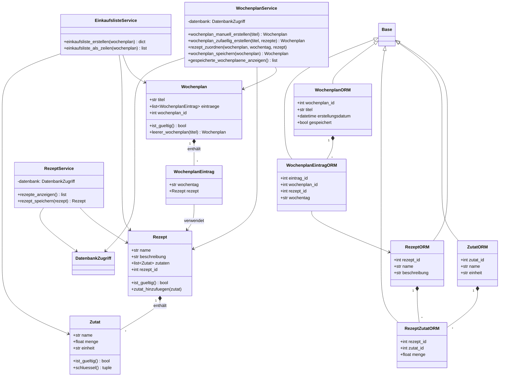

```mermaid
classDiagram

%% =========================
%% DOMAIN
%% =========================

class Zutat {
    +str name
    +float menge
    +str einheit
    +ist_gueltig() bool
    +schluessel() tuple
}

class Rezept {
    +str name
    +str beschreibung
    +list~Zutat~ zutaten
    +int rezept_id
    +ist_gueltig() bool
    +zutat_hinzufuegen(zutat)
}

class WochenplanEintrag {
    +str wochentag
    +Rezept rezept
}

class Wochenplan {
    +str titel
    +list~WochenplanEintrag~ eintraege
    +int wochenplan_id
    +ist_gueltig() bool
    +leerer_wochenplan(titel) Wochenplan
}

%% =========================
%% SERVICES
%% =========================

class EinkaufslisteService {
    +einkaufsliste_erstellen(wochenplan) dict
    +einkaufsliste_als_zeilen(wochenplan) list
}

class RezeptService {
    -datenbank: DatenbankZugriff
    +rezepte_anzeigen() list
    +rezept_speichern(rezept) Rezept
}

class WochenplanService {
    -datenbank: DatenbankZugriff
    +wochenplan_manuell_erstellen(titel) Wochenplan
    +wochenplan_zufaellig_erstellen(titel, rezepte) Wochenplan
    +rezept_zuordnen(wochenplan, wochentag, rezept)
    +wochenplan_speichern(wochenplan) Wochenplan
    +gespeicherte_wochenplaene_anzeigen() list
}

%% =========================
%% DATA ACCESS / ORM
%% =========================

class Base

class RezeptORM {
    +int rezept_id
    +str name
    +str beschreibung
}

class ZutatORM {
    +int zutat_id
    +str name
    +str einheit
}

class RezeptZutatORM {
    +int rezept_id
    +int zutat_id
    +float menge
}

class WochenplanORM {
    +int wochenplan_id
    +str titel
    +datetime erstellungsdatum
    +bool gespeichert
}

class WochenplanEintragORM {
    +int eintrag_id
    +int wochenplan_id
    +int rezept_id
    +str wochentag
}

class DatenbankZugriff

%% =========================
%% DOMAIN RELATIONS
%% =========================

Rezept "1" *-- "*" Zutat : enthält
Wochenplan "1" *-- "*" WochenplanEintrag : enthält
WochenplanEintrag --> Rezept : verwendet

%% =========================
%% SERVICE RELATIONS
%% =========================

EinkaufslisteService --> Wochenplan
EinkaufslisteService --> Rezept
EinkaufslisteService --> Zutat

RezeptService --> Rezept
RezeptService --> DatenbankZugriff

WochenplanService --> Wochenplan
WochenplanService --> Rezept
WochenplanService --> DatenbankZugriff

%% =========================
%% ORM RELATIONS
%% =========================

Base <|-- RezeptORM
Base <|-- ZutatORM
Base <|-- RezeptZutatORM
Base <|-- WochenplanORM
Base <|-- WochenplanEintragORM

RezeptORM "1" *-- "*" RezeptZutatORM
ZutatORM "1" *-- "*" RezeptZutatORM

WochenplanORM "1" *-- "*" WochenplanEintragORM

WochenplanEintragORM --> RezeptORM

```